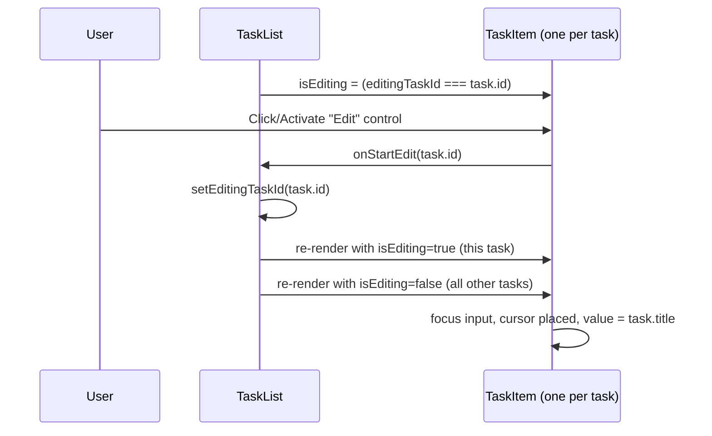

# Architecture — EPMCDMETST-66637: Enter edit mode for a task to change its title

## Where this fits
Frontend-only change inside the existing TaskLite React app (`frontend/src`).
No backend, route, controller, or `tasks` entity change — entering edit mode
makes no API call, per the approved requirements.

## Picture

## Components and who does what
| Component | Responsibility | New / Changed |
|---|---|---|
| `TaskList` (`frontend/src/components/TaskList.tsx`) | Owns `editingTaskId` state (single source of truth so only one task is ever in edit mode); passes `isEditing` and `onStartEdit` down to each `TaskItem` | Changed |
| `TaskItem` (`frontend/src/components/TaskItem.tsx`) | Renders the Edit control; when `isEditing` is true, renders a text input prefilled with the task's current title, focuses it and places the cursor on entry | Changed |

## Technology picks
Stays on the declared stack (TypeScript, React). No new dependency —
edit-mode entry is plain component state (`useState` in `TaskList`) plus a
`useRef`/`useEffect` focus call in `TaskItem`.

## How data moves
No entity or API involvement. `task.title` already present in the `tasks`
data already fetched/rendered by `TaskList`/`TaskItem` is reused, unchanged,
as the prefilled input value. No write to the `tasks` entity occurs as part
of this story.

## Contracts introduced or touched
- No API signatures or event shapes change (no backend call is made).
- Internal UI contract only: `TaskItem` gains two props —
  `isEditing: boolean` and `onStartEdit: (taskId: string) => void` —
  supplied by `TaskList`.

## Risks and assumptions
- Assumes `TaskList` already has access to each task's `id` and `title` to
  pass down (per the existing rendering of the task list).
- Keyboard accessibility is assumed satisfied by using a native `<button>`
  for the Edit control and a native `<input>` for editing, both focusable
  and operable via keyboard by default — no custom widget needed.
- Lifting `editingTaskId` into `TaskList` (rather than local state per
  `TaskItem`) is what guarantees the "only one task in edit mode at a time"
  acceptance criterion; a per-item local-state design would not enforce
  that on its own.
