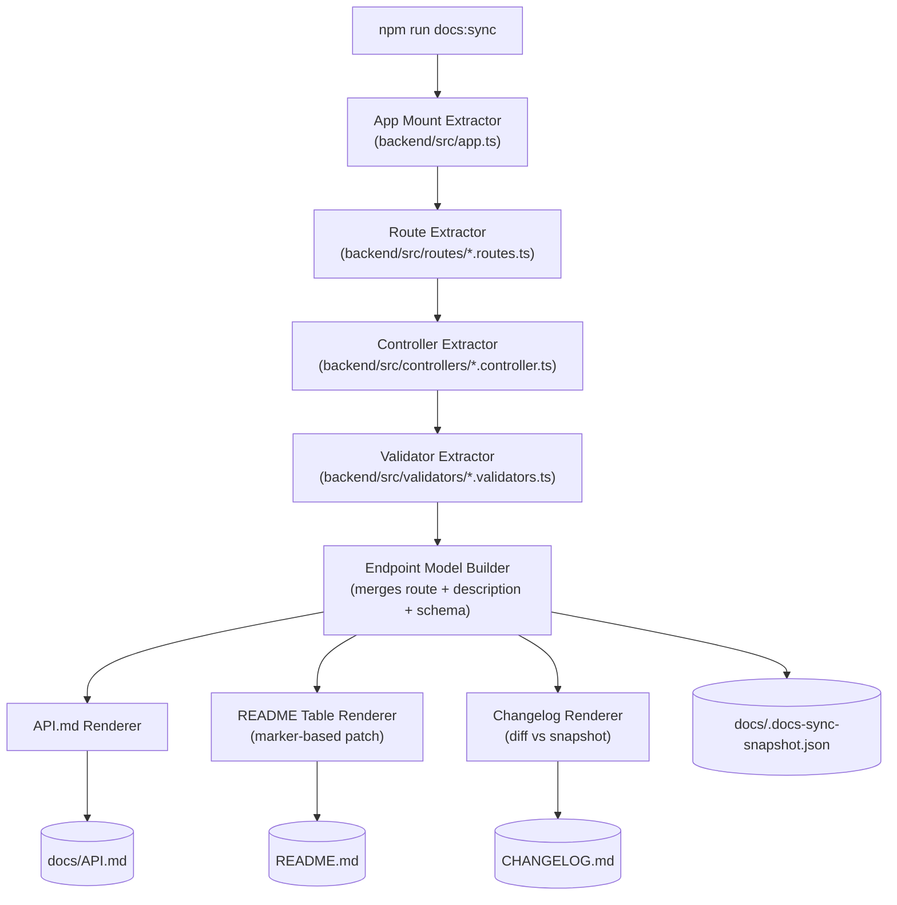

# Architecture: Automated Documentation Sync

## Goal

Regenerate documentation (`docs/API.md`, the README API table, `CHANGELOG.md`) directly from the backend's Express routes, controllers, and Zod validators, on demand, with zero new runtime dependencies.

## High-Level Flow



## Components & Responsibilities

| Component | File | Responsibility |
|-----------|------|-----------------|
| CLI entry point | `scripts/docs-sync.mjs` | Orchestrates the pipeline; reports a summary to the console; sets exit code. |
| App mount extractor | `scripts/docs-sync/extract-app-mounts.mjs` | Parses `backend/src/app.ts` for `app.use("<prefix>", <routerVar>)` calls, producing a map of router variable name → mount prefix, so route paths are never hardcoded. |
| Route extractor | `scripts/docs-sync/extract-routes.mjs` | Statically parses `*.routes.ts` for `<router>.<method>("path", handler)` calls and joins each path with the prefix resolved by the app mount extractor. Handles both named-handler routes and inline arrow-function routes (e.g. health check). |
| Controller extractor | `scripts/docs-sync/extract-controllers.mjs` | Given a handler name, finds its exported function in `*.controller.ts`, reads the leading `//` comment as the description, detects `res.status(code)` calls for success responses, detects `HttpError(code, message)` calls for error responses, and detects which validator schema (if any) is used via `<schema>.safeParse(...)`. |
| Validator extractor | `scripts/docs-sync/extract-validators.mjs` | Parses `export const xSchema = z.object({ ... })` blocks in `*.validators.ts` into a field list: name, zod type, required/optional, and constraints (`.min()`, `.enum([...])`, messages). |
| Endpoint model | (in-memory, built in `docs-sync.mjs`) | Combines the above into one array of `{ method, path, handlerName, description, requestSchema, responses }`. This is the single in-memory "source of truth" object all renderers consume — keeps renderers independent of parsing details. |
| API.md renderer | `scripts/docs-sync/render-api-doc.mjs` | Produces the full Markdown reference document. |
| README patcher | `scripts/docs-sync/render-readme-table.mjs` | Replaces the content between `<!-- docs-sync:api-table:start -->` / `...:end -->` markers in `README.md` with a regenerated table. Leaves the rest of the file untouched. |
| Changelog renderer | `scripts/docs-sync/render-changelog.mjs` | Loads `docs/.docs-sync-snapshot.json` (previous endpoint fingerprint list), diffs it against the current endpoint model, and — only if different — prepends a dated entry to `CHANGELOG.md` under `## [Unreleased]`, then writes the new snapshot. |

## Technology Choices

- **Plain Node.js (ESM, `.mjs`), no new dependencies.** Rationale: the tool must run without `npm install`/Prisma generation (NFR-1, NFR-2); regex/text-based static parsing over the small, consistently-formatted route/controller/validator files is sufficient and keeps the tool trivial to audit.
- **Static text parsing instead of a TS compiler API / AST library** (e.g., `ts-morph`). Rationale: avoids adding a dependency for a small, stable code shape (3 route files, 1 controller file, 1 validator file); a comment documents the pattern the parser expects so future contributors keep code "parseable".
- **Marker-comment patching for README** instead of regenerating the whole file. Rationale: keeps human-authored prose in `README.md` intact; only the auto-generated table is owned by the tool.
- **Snapshot-diff changelog** instead of parsing `git log`. Rationale: deterministic, works without a git history, and only ever describes *documentation-relevant* changes (endpoint additions/removals/changes), not unrelated commits.

## Data Flow / Contracts

Endpoint model shape (internal, not persisted except as a snapshot):

```js
{
  method: "POST",
  path: "/api/tasks",
  handlerName: "createTask",
  description: "Create a new task.",
  requestSchema: {
    name: "createTaskSchema",
    fields: [{ name: "title", type: "string", required: true, constraints: ["min(1)"] }]
  },
  responses: [
    { status: 201, meaning: "Created" },
    { status: 400, meaning: "title is required" }
  ]
}
```

Snapshot file (`docs/.docs-sync-snapshot.json`): array of `{ method, path, description, requestFields }` used purely for diffing; regenerated on every run that produces changes.

## Key Design Decisions

1. Code comments are the description source (FR-3) — enforces documentation-as-code instead of a separate hand-maintained description list that can drift.
2. All file writes are additive/patch-based except `docs/API.md`, which is fully regenerated (it is 100% generated content, never hand-edited).
3. The tool never touches the database or imports backend modules at runtime — pure text parsing keeps it fast and dependency-free (NFR-2).

## Out of Scope (carried from requirements.md)

- CI enforcement, OpenAPI generation, frontend documentation.
